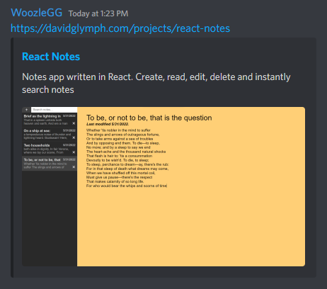

After much delay, I've finally come around to making this website. Having owned this domain for several years, I wanted to have a place to store miscellaneous notes, document my projects, and act as a landing page to learn more about me.

This is a static site built with [Gatsby](https://gatsbyjs.com) hosted on [Github Pages](https://pages.github.com). I chose Gatsby as my static site generator of choice for several reasons:
- Familiar use of React for layout and page components
- Official support for MDX markdown rendering
- Built in router to eliminate browser refreshs
- Style modularity with SASS modules
- Responsive images with progressive blurred loading
- GraphQL for easy data querying
- Excellent community support with large plugin library

An essential requirement I had was the ability to write posts using Markdown. Gatsby supports two popular tools to transformer Markdown into HTML: [Remark](https://github.com/remarkjs/remark) and [MDX](https://mdxjs.com/). They both are quite similar, but MDX supports embedding React components directly within the markdown. It also supports most plugins written for Remark, so there is not much downside to using MDX.

***

# Markdown Plugins
Here are the Markdown plugins I currently have installed.

## `gatsby-remark-images`
Processes images included in the markdown file to be included in the final build. It downscales the image to an appropriate resolution to prevent excessive load times. It also prevents a page jumped by rendering a low resolution version of the image while the final version is being downloaded. You can see this in action if you refresh this page!


## `gatsby-remark-autolink-headers`
Generates anchor links on all the headers in the Markdown document, allowing individual sections to be linked to individually. Hover to the left of any of the headers to see the links!

## `gatsby-remark-copy-linked-files`
Moves files linked in the Markdown document to a static hashed folder in the root directory. Click the link below to download a linked file (just a small text file).

[Download file](testfile.txt)

## `prism-react-renderer`
This isn't a plugin for the Markdown image but instead a React component to stylize code blocks. It uses [`prismjs`](https://github.com/PrismJS/prism) for the language highlighting and automatically replaces the generated `<code>` tags with nicely formatted and stylized code. Here is a meta example showing the `<CodeBlock />` component that handles the rendering.

```tsx
const CodeBlock = (props: any) => {
    const className = props.children.props.className || '';
    const matches = className.match(/language-(?<lang>.*)/);

    return (
        <Highlight {...defaultProps}
            code={props.children.props.children.trim()}
            language={
                matches && matches.groups && matches.groups.lang
                ? matches.groups.lang : ''}
            theme={theme}>

            {({className, style, tokens, getLineProps, getTokenProps}: any) => (
            <pre className={className}
                style={{
                    ...style,
                    padding: '1rem',
                    wordBreak:"break-word",
                    whiteSpace:"pre-wrap", 
                    borderRadius:"8px"
                }}>
                {tokens.map((line: any, i: number) => (
                    <div key={i} {...getLineProps({line, key: i})}>
                        {line.map((token: any, key: number) => (
                            <span key={key} {...getTokenProps({token, key})} />
                        ))}
                    </div>
                ))}
            </pre>
            )}
        </Highlight>
    );
};
```

## `remark-math` and `rehype-katex`
These plugins allow me to render math in the popular typesetting format LaTeX. `remark-math` parses the Markdown file for `$` signs, denoting sections of math. Then, `rehype-katex`, handles the DOM tree structure and styling, which finally renders beautifully styled math.

It supports inline math $a^2 = b^2 + c^2$ and also blocks:

$$
\left( \sum_{k=1}^n a_k b_k \right)^2 \leq \left( \sum_{k=1}^n a_k^2 \right) \left( \sum_{k=1}^n b_k^2 \right)
$$

$$
\frac{1}{\Bigl(\sqrt{\phi \sqrt{5}}-\phi\Bigr) e^{\frac25 \pi}} \equiv 1+\frac{e^{-2\pi}} {1+\frac{e^{-4\pi}} {1+\frac{e^{-6\pi}} {1+\frac{e^{-8\pi}} {1+\cdots} } } }
$$


$$
s_N(x) = \sum^N_{n=-N} c_n \cdot e^{(i2\pi nx/P)}
$$

***

# Gatsby Plugins
In addition, I have several site-wide Gatsby plugins installed. I've selected the most notable to discuss.

## `gatsby-plugin-use-dark-mode`
Ties in the popular React hook [`use-dark-mode`](https://github.com/donavon/use-dark-mode). It provides a hook that can be used to toggle a class on the `<body>` tag to easily implement light and dark mode.

## `gatsby-plugin-sitemap`
Programmatically generates an XML sitemap of all the pages on the site. This is used by search engine crawlers to index and rank pages. If you want, you can view the raw XML it generates [here](https://davidglymph.com/sitemap/sitemap-0).

## `gatsby-plugin-react-helmet`
Implements the [React Helmet](https://github.com/nfl/react-helmet) component to manage tags in `<head>`. I primarily use this plugin to construct an `<SEO />` component that dynamically adds metadata to the page based on information pulled from the Markdown frontmatter data through GraphQL.

Thus, each page has appropriate metadata including the title, summary, and cover image in compliance with the [Open Graph](https://ogp.me/) protocol. This information is commonly used by social media sites like Slack, Twitter and Discord to show a information card when a link is shared. See this example of a shared projects link in Discord:



## `gatsby-plugin-manifest`
Takes an SVG of my logo and automatically generates all the correct sizing for the favicon (icon in the page tab) and icons for when the webpage is added to the users home page. 

***

That's all I have as of now -- I'm pretty happy with the finished product. Check back for more updates!