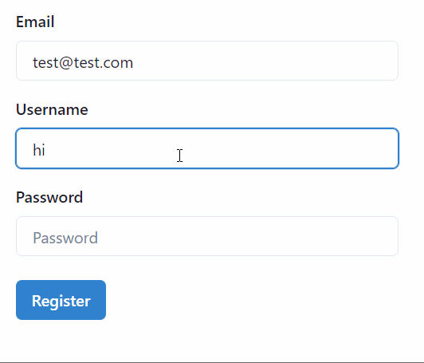
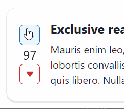
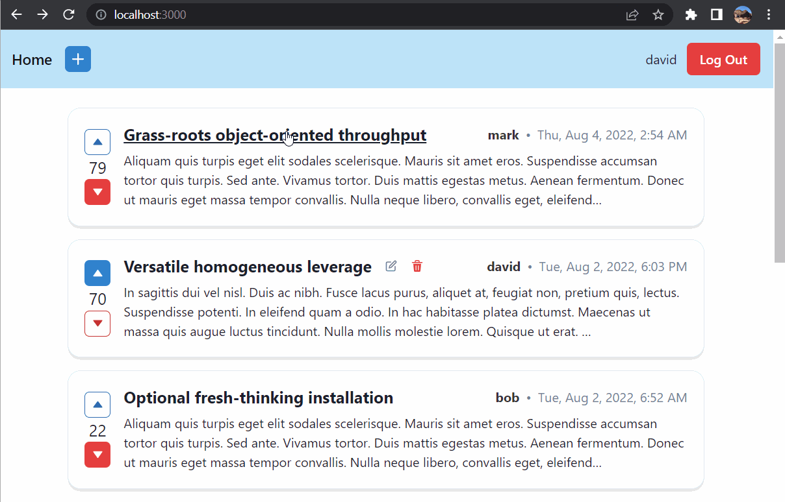
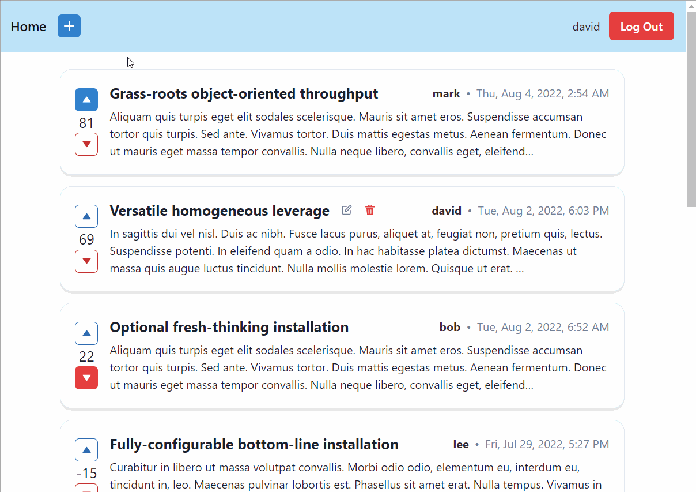
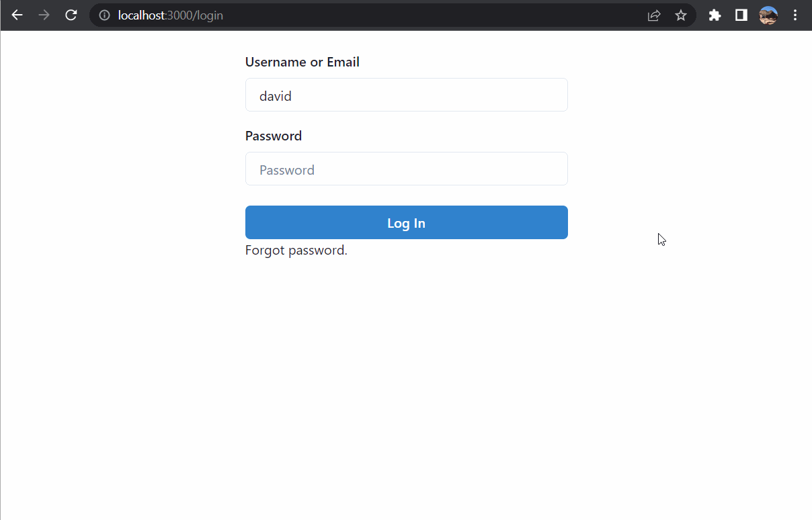

[View source on Github [frontend]](https://github.com/Woozl/forum-frontend)  
[View source on Github [backend]](https://github.com/Woozl/forum)

This is a Next.js app that implements a forum functionality similar to Reddit or Stack Overflow. Based on Ben Awad's great [tutorial](https://youtu.be/I6ypD7qv3Z8). Users have the ability to create, edit, delete and vote on posts. The backend code was written in Node/Typescript and can be viewed at [this repository](https://github.com/Woozl/forum).

---

## Technologies

### Client-side

- Next.js / React / Typescript
- URQL GraphQL client and cache
- Chakra UI
- Formik

### Server-side

- Node / Typescript
- Express
- TypeORM using PostgreSQL
- TypeGraphQL
- Apollo GraphQL Server
- Redis
- Argon2

---

## Features

### User management

Registration form calls a GraphQL mutation to check whether the user has submitted a valid email, username, and password. If not, an error object is returned, which is used by Formik to display context-relevant errors in the form.

Upon registration or login, a session cookie is created in the user's browser and cached in Redis for quick retrieval. For each request requiring authentication, the user's cookie is sent to the server by the browser, which allows it to be compared to the key in Redis.

### Password Storage

Users are stored in a Postgres table, along with their hashed password. Note that passwords are just hashed using argon2, but are not salted. In a real environment, passwords should be concatenated with a random salt string and the hashing algorithm should be tuned to an appropriate balance between performance and resistance to brute force attacks. This project was primarily for learning purposes, many fine details of proper system security were omitted.

### Voting on posts

Users can vote on a post through a GraphQL mutation which does the relevent authentication checks. If the user is not logged in, it redirects them to the login page. If all the checks pass, the vote is stored in a seperate table with foreign keys for both the user and post. An update is specified in `createUrqlClient.ts` on the `vote` mutation to rewrite the cache with the updated vote information. This means the user will immediately see the effect of their vote.

On the front-end, Chakru UI `IconButtons` are configured to show loading spinners while the data is fetching, and then turn a solid color indicating the vote status.

### Cursor-based pagination

The `posts` query takes in a `limit` and optionally a `cursor` argument. Thus, the UI can render a selection of all the posts and use the `cursor` argument to get the next batch when required. This implementation gets the posts added before the `cursor`, which is specified as a Unix timestamp date. Theoretically, two posts could be posted at exactly the same time, causing a tie. In a production app, this pagination could be improved by allowing sorting on different parameters or directions.

### Viewing a post

Each post on the index page creates a Next.js link to a dynamic route with the post id. For example, the link may look like `https://example.com/post/123`, where `123` is the post id. On this page, the query pulls the url parameter through Next.js and grabs the content for the correct post, which is then rendered. Before the content hash completely loaded, there is a skeleton UI state to make the layout feel responsive and active.

### Creating, editing and deleting a post

Calling any mutation to interact with a post first calls the authorization function to make sure a user is logged in. If they aren't, they are redirected to the login screen. Once the user successfully logins in or registers, they are redirected to their initially requested location.

To create a post, the user is sent to a form for the title and text of the post. When the user submits, the post is stored to the database with a `creatorId` foreign key, and the cache is updated.

To edit or delete a post, an additional authentication check is run to make sure the user making the request is the same user that created the post. To reflect this, the front end UI conditionally displays edit and delete icons if the user owns the post.

Editing a post redirects the user to a form page with a url containing the post id. Using Next.js this is incredible easy using dynamic routes and query parameters. What this looks like is a URL such as `https://example.com/post/edit/123`, where `123` is the post id. When the button is clicked to update the post, the mutation grabs the query parameter from the page to get the correct post to make changes to.

Deleting a post removes the post from the database, performing a cascade delete to discard related data in the votes table.

### Forgot Password

If the user is on the login page and forgets their password, they can click the 'Forgot Password' button to change it. This button redirects them to the `/forgot-password` route, where they enter and submit the email address associated with the account. The page returns a generic message:

> If an account with that email exists, we've sent it an email.

We don't want bad actors to be able to submit this form and gain information about who has an account at the website, so we intentionally do not return any information from the `forgotPassword` mutation, just a boolean value that we've received the request.

The `forgotPassword` generates a random UUID token and stores it in Redis with an expiration time of 1 hour. It sends the user an email with a link to a change password form. This link also contains the unique token. For example, the link may look like this:

> `http://example.com/change-password/a93fa31f-ff08-4fd5-9976-7764fd36bf68`

_Note that for development, there is not a real email service set up, the email is sent with `nodemailer`, and received by Ethereal, a fake SMTP service._

By clicking on the link, the user is sent to a change password former where they submit a new password. The `changePassword` mutation first returns an error if the password is not valid. Then it checks that the token on the page matches the key in Redis. If they match, the password is updated and the key is removed from Redis. If the token isn't valid, the front-end displays a link to send another email.

