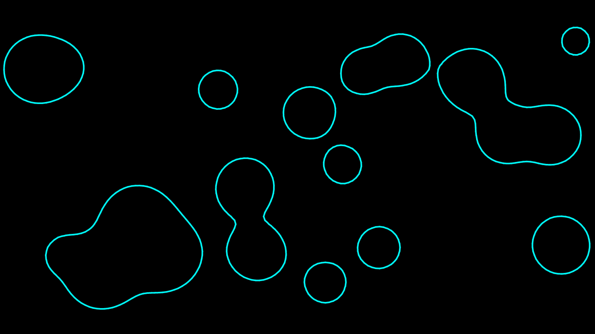

[View source on Github](https://github.com/Woozl/metaballs/blob/master/script.js)

[View demo](https://davidglymph.com/metaballs)

This webpage generates [metaballs](https://wikipedia.org/wiki/Metaballs), organic looking blobs that morph together when they're close. 

It generates a grid of scalar values based on every circle's influence on a cell. The marching square algorithm is then used to generate a contour line approximately along a constant value in the grid. This line is then drawn to the screen.