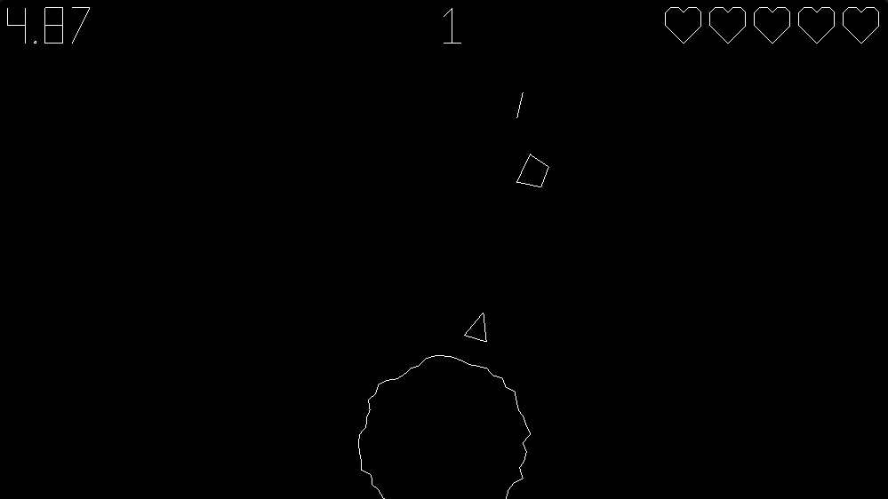

[View source on Github](https://github.com/Woozl/planet-defender)

[View demo](https://davidglymph.com/planet-defender)

This is a quick game I wrote to learn how to embed Rust binaries in a webpage using Webassembly. The graphics in the game are written using the [wgpu](https://crates.io/crates/wgpu) crate. This provides a platform-agnostic way of writing GPU shader code that then target a myriad of backend APIs (Vulkan, Metal, DX11, DX12, GL, WebGPU). Because it supports GL languages, wgpu offers also offers compilation to Webassembly to use WebGL on websites (at the time of writing, WebGPU support is limited to Chrome Canary and Firefox Nightly builds). WGSL is the shading language wgpu interprets and is similar in many ways to GLSL. Here's the vertex and fragment shader I used:

```ts
struct CameraUniform {
    view_proj: mat4x4<f32>,
};
@group(1) @binding(0)
var<uniform> camera: CameraUniform;

struct VertexInput {
    @location(0) position: vec3<f32>,
    @location(1) color: vec3<f32>,
};

struct VertexOutput {
    @builtin(position) clip_position: vec4<f32>,
    @location(0) color: vec3<f32>,
};

@vertex
fn vs_main(
    model: VertexInput,
) -> VertexOutput {
    var out: VertexOutput;
    out.color = model.color;
    out.clip_position = vec4<f32>(model.position, 1.0);
    return out;
}

@fragment
fn fs_main(in: VertexOutput) -> @location(0) vec4<f32> {
    return vec4<f32>(in.color, 1.0);
}
```

A lot of this code was adapted from this great [wgpu tutorial](https://sotrh.github.io/learn-wgpu/). The first struct defines a camera uniform containing a projection matrix. I didn't really use this in the project, but it would allow the GPU to efficiently rerender at different camera angles. The main vertex shader takes in input [x, y, z] and color [r, g, b] tuples which can be copied to the buffer. Since I'm just drawing lines, the fragment shader is very rudimentary, simply taking the color at the vertex and interpolating it to the next vertex's color. For my implementation, I just hardcoded each line to be white. I also set the rendering pipeline mode to `wgpu::PrimitiveTopology::LineList`, which connects each consecutive vertex in the buffer with a line. I'm not sure how much value this mode would have for other types of applications, but for the line-based style I was going for, it worked well. It is worth noting that the lines are a single pixel wide and not anti-aliased, and changing this cannot be easily achieved without adding more triangles.

In order to make the program render on and be interactive, it has to run on a windowing manager. For this I used [winit](https://crates.io/crates/winit). It provides a event loop that responds to keyboard input, resizing, cursor, etc, and works cross-platform. You can use the same code to handle application windows on Mac, Linux, Windows, and in the browser with native web event bindings. You should be able to play the game on my website, or build a binary executable on the platform of your choice, all from one codebase:

```bash
git clone git@github.com:Woozl/planet-defender.git && cd planet-defender
cargo r
```
> To run cargo, you have to install [rustup](https://www.rust-lang.org/tools/install)

`lib.rs` contains a `State` struct to hold all of the top level configuration and has several methods that refresh the state. A singleton instance of this struct is called in the main `run` function, which is called asynchronously by `main.rs`. The constructor of the `State` struct also contains an instance of a `Game` struct, defined in `game.rs`. This struct handles the state of the game, such as how many lives the player has left, the current difficulty, and how many asteroids were destroyed. It has a `draw` method that is called every frame: 

```ts
pub fn draw(&mut self) {
    self.lines.clear_lines();
    let new_time = Instant::now().duration_since(self.program_begin).as_millis();
    let dt = new_time - self.current_ms;
    self.current_ms = new_time;

    if self.lives <= 0 {
        self.is_game_over = true;
    }

    if !self.is_game_over {
        self.game_time = self.current_ms - self.start_time;
    }

    if self.asteroids_destroyed < 30 {
        self.asteroid_spawn_rate = 2000;
    } else if self.asteroids_destroyed < 60 {
        self.asteroid_spawn_rate = 1500;
    } else if self.asteroids_destroyed < 80 {
        self.asteroid_spawn_rate = 1200;
    } else if self.asteroids_destroyed < 100 {
        self.asteroid_spawn_rate = 1000;
    } else if self.asteroids_destroyed < 120 {
        self.asteroid_spawn_rate = 800;
    } else if self.asteroids_destroyed < 150 {
        self.asteroid_spawn_rate = 600;
    } else {
        self.asteroid_spawn_rate = 400;
    }

    if !self.is_game_over
        && self.current_ms - self.last_asteroid_time > self.asteroid_spawn_rate
    {
        self.add_asteroid(20.0);
        self.last_asteroid_time = self.current_ms;
    }

    if self.is_game_over {
        self.draw_game_over();
    }
    self.draw_ship();
    self.draw_planet();
    self.draw_lasers(dt);
    self.draw_text(
        &format!("{:.2}", self.game_time as f64 / 1000.0),
        10.0,
        10.0,
    );
    self.draw_text(&format!("{}", self.asteroids_destroyed), 500.0, 10.0);
    self.draw_hearts(self.lives, WIDTH as f32 - 10.0, 10.0);
    self.draw_asteroids(dt);
    self.check_collision();
}
```

The main draw method calls private draw methods for each item, and then checks collisions based on distance between the objects. All of the draw methods utilize a simple drawing abstraction that adds a line between two `Point`s. All of the drawing code is defined in `draw.rs`. When the next frame is required, all of the existing vertices in the `LineHandler` instance are copied onto the main vertex buffer. The `LineHandler` acts as a proxy allowing the user to only add a line or clear the whole screen. Obviously this is not super performant, you would probably want a bit more control of how the vertices are drawn, I just wanted a simple API. For example, in the game, the asteroids rotate by moving each point around the origin according to the following equations:

$$
x' = x\cos{\theta} - y\sin{\theta}
$$
$$
y' = y\cos{\theta} + x\sin{\theta}
$$

Or this matrix transformation:

$$
\begin{pmatrix}
x' \\ y'
\end{pmatrix}
=
\begin{pmatrix}
\cos{\theta} & -\sin{\theta} \\
\sin{\theta} & \cos{\theta}
\end{pmatrix}

\begin{pmatrix}
x \\ y
\end{pmatrix}
$$

The way I'm doing it, I'm:
1. iterating over each point on the vector
2. performing the the rotation calculations on the CPU
3. storing the updated coordinates to the vector
4. adding the lines to the `LineHandler` based on vertices from the vector

Because I'm reading each point from the heap and doing CPU calculations each frame, this is a huge bottleneck. On a 3D game with hundreds of thousands of vertices, this would dramatically reduce performance. GPUs are built to do tons of parallel calculations, and rotating the points should be possible by running a rotation matrix over the buffer. I'm not too experienced with graphics programming and this game is not intensive at all, so it's acceptable--my computer will run it smoothly on my monitor at 144 frames per second. 

## Webassembly with wasm-pack

The main reason I built this project was to learn how to implement compiled code into webpages. This is a technology that is rapidly expanding and I believe will be very important to the future of web applications. [Figma](https://www.figma.com/) is a design application that has a [rendering engine writting in C++ and compiled to Webassembly](https://www.figma.com/blog/webassembly-cut-figmas-load-time-by-3x/), resulting in a fast and native-feeling app. Another cool website is [Runway](https://runwayml.com), which is a video editing application with a fast video decoder running as Webassembly. 

There is a whole bunch that goes on to get Webassembly to work: any code inside your app that needs to interact with any of the browser APIs (mouse, audio, etc.) has to have bindings to the Javascript calls. Thankfully, for Rust, there is [wasm-bindgen](https://github.com/rustwasm/wasm-bindgen), which provides battle-tested bindings for the browser APIs. There is another tool called [wasm-pack](https://github.com/rustwasm/wasm-pack) that provides a CLI tool to automatically generate everything you need to run as a `<script>` in a webpage, or generate a npm package. By running:

```bash
wasm-pack build -t web
```

wasm-pack will generate a `pkg` folder in the crate directory, which contains the `.wasm` file, a Javascript file with all the required exports, and even a Typescript declaration file to get static typing! Once the binary is generated, it's as simple as importing using a script tag:

```html
<script type="module">
   import init from "./pkg/planet_defender.js";
   init().then(() => {
      console.log("WASM Loaded");
   });
</script>
```

There were two modules that do not work on Webassembly: `rand` and `std::time::Instant`. Thankfully, the community provides wrappers that can utilize the browser's random number generator and time functions--[`getrandom`](https://crates.io/crates/getrandom) and [`instant`](https://crates.io/crates/instant). Overall, however, I was very impressed at how smooth the process was with `wasm-pack`, essentially one command and you have the all the bindings you need along with the WASM binary.

[Play the game](https://davidglymph.com/planet-defender) and see what you think!