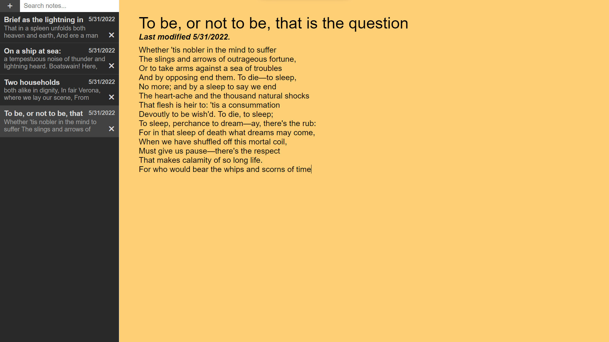

# A picture of notes!


```verilog
module jsrflipflop(q,qbar,clk,rst,sr);
	output reg q;
	output qbar;
	input clk, rst;
	input [1:0] sr;

	assign qbar = ~q;

	always @(posedge clk)
	begin
		if (rst)
			q <= 0;
		else
			case(sr)
				2'b00: q <= q;
				2'b01: q <= 0;
				2'b10: q <= 1;
				2'b11: q <= 1'bx;
			endcase
	end
endmodule
```

```tsx
const Navbar = () => {
    const darkMode = useDarkMode(true);

    return (
        <nav className={nav}>
            {/* <h1><Link to='/'>David Glymph</Link></h1> */}
            <Link style={{height: "3rem"}} to='/'><Icon fill={darkMode.value ? '#fff' : '#000'} ></Icon></Link>
            <ul>
                <li><Link to='/blog'>blog</Link></li>
                <li><Link to='/projects'>projects</Link></li>
                <li style={{cursor: "pointer", userSelect: "none"}} onClick={darkMode.toggle}>{darkMode.value ? "🌞":"🌚"}</li>
            </ul>
        </nav>
    )
};
```