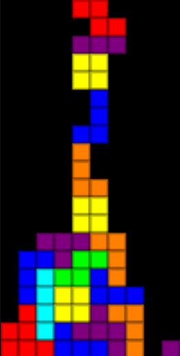

[View source on Github](https://github.com/Woozl/tetris)

[View demo](https://davidglymph.com/tetris)

A clone of Tetris I wrote a while back. Quite a fun challenge to implement. Pieces are stored as arrays, checked against the game board to see if the requested move is legal, and added to the game board once any of their cells is in contact with another piece. As the game board is just a 2D array, checking for clearable rows is simple using `.includes()`. The scoring system is based off the original Tetris -- you get more points for clearing multiple rows at once. Based on the current level, the pieces drop faster and faster!